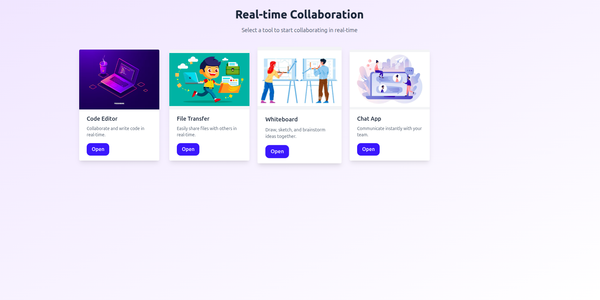
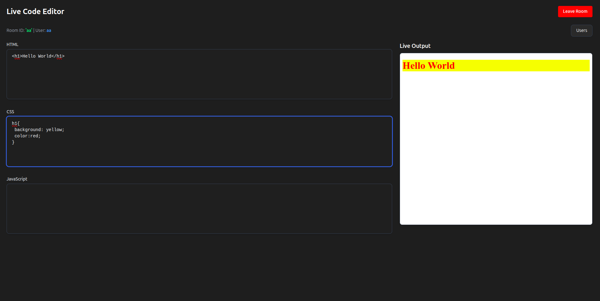
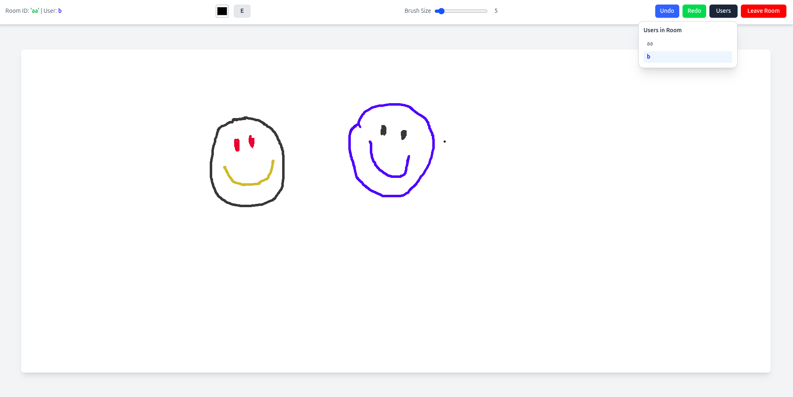
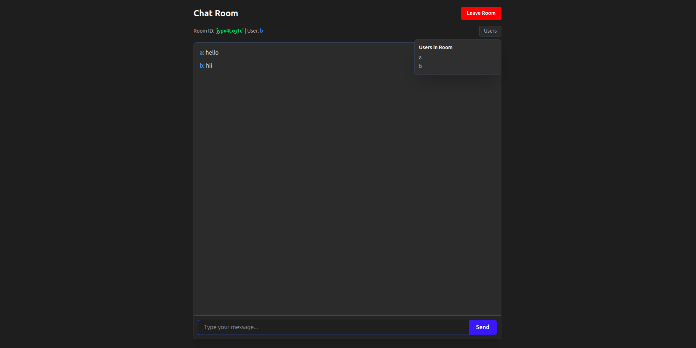

# ✏️ Simple Realtime Collaboration

A **local realtime collaboration system** built to let multiple users collaborate seamlessly in real time.

---

## ✨ Features

- Realtime code editing / drawing / chat
- Local network support
- Lightweight and easy to run

---

## 🖼️ Screenshots

### Main Collaboration Panel


### CodeEditor Panel


### Drawing Panel


### Chat Panel


---

## 🚀 Installation & Setup

Clone the repository:

```bash
git clone https://github.com/nabin2005/simple-realtime-collaboration.git
cd simple-realtime-collaboration
